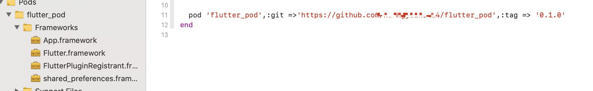
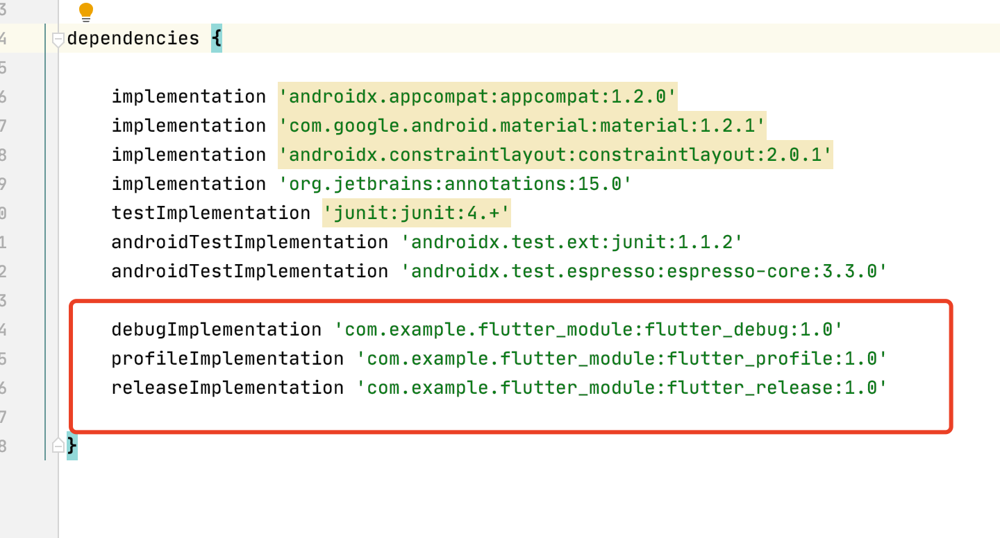

## 将flutter以framework的形式混编

两种方式，一种是官方的方案，规范，不过如果是多人开放，需要每个人的电脑都有flutter环境。

另一种则是这里要讲的，通过framework的方式进行混编，多人开发比较友好。

- 创建`iOS`工程，原生工程项目（自己的项目也是一样的，这里就是创了演示一下）


- 创建`flutter`文件夹，`flutter`工程项目，文件夹下执行命令`flutter create -t module flutter_module`，会自动生成模版项目


- 假设`flutter`项目里用到了第三方插件，如下


- 通过以下命令编译得到产物(我们需要的东西)。

```
flutter build ios --debug
flutter build ios --release --no-codesign
```


- 这里用了别人的一个脚本文件(`move_file.sh`)，稍微改了一下路径，原来的路径不太对了，作用就是通过脚本创建一个文件夹，将编译后的这些库统一拷贝到一起。`sh move_file [debug/release]`跑一下就行了。

```
if [ -z $out ]; then
    out='ios_frameworks'
fi

echo "\033[34m 准备输出所有文件到目录: $out \033[0m"

echo "\033[34m 清除所有已编译文件 \033[0m"
find . -d -name build | xargs rm -rf
flutter clean
rm -rf $out
rm -rf build

flutter packages get

addFlag(){
    cat .ios/Podfile > tmp1.txt
    echo "use_frameworks!" >> tmp2.txt
    cat tmp1.txt >> tmp2.txt
    cat tmp2.txt > .ios/Podfile
    rm tmp1.txt tmp2.txt
}

echo "\033[34m 检查 .ios/Podfile文件状态 \033[0m"
a=$(cat .ios/Podfile)
if [[ $a == use* ]]; then
    echo "\033[34m 已经添加use_frameworks, 不再添加 \033[0m"
else
    echo "\033[34m 未添加use_frameworks,准备添加 \033[0m"
    addFlag
    echo "\033[34m 添加use_frameworks 完成 \033[0m"
fi

flutter_build_debug_simulator(){
    flutter build ios --debug --simulator
}
flutter_build_debug_device(){
    flutter build ios --debug
}
flutter_build_release_device(){
    flutter build ios --release --no-codesign
}

echo "\033[34m 编译flutter \033[0m"
if [[ $1 == 'release' ]]; then #relase模式 只能真机
        if [[ $2 == 'sim' ]]; then
            echo "\033[31m relase模式 只能真机，编译真机ing \033[0m"
        fi
        flutter_build_release_device
elif [[ $1 == 'debug' ]]; then
    if [[ $2 == 'sim' ]]; then
        flutter_build_debug_simulator
    else
        flutter_build_debug_device
    fi
elif [[ $1 == 'sim' ]]; then #模拟器 只能debug
        flutter_build_debug_simulator
else
    flutter_build_debug_device  #默认debug 真机
fi

copy_release_iphone(){
    xcrun bitcode_strip build/ios/Release-iphoneos/Flutter.framework/Flutter -r -o build/ios/Release-iphoneos/Flutter.framework/Flutter
    cp -r build/ios/Release-iphoneos/*/*.framework $out
    cp -r build/ios/Release-iphoneos/App.framework $out
    cp -r build/ios/Release-iphoneos/Flutter.framework $out
}
copy_debug_iphone(){
    xcrun bitcode_strip build/ios/Debug-iphoneos/Flutter.framework/Flutter -r -o build/ios/Debug-iphoneos/Flutter.framework/Flutter
    cp -r build/ios/Debug-iphoneos/*/*.framework $out
    cp -r build/ios/Debug-iphoneos/App.framework $out
    cp -r build/ios/Debug-iphoneos/Flutter.framework $out
}
copy_debug_simulator(){
    xcrun bitcode_strip build/ios/Debug-iphonesimulator/Flutter.framework/Flutter -r -o build/ios/Debug-iphonesimulator/Flutter.framework/Flutter
    cp -r build/ios/Debug-iphonesimulator/*/*.framework $out
    cp -r build/ios/Debug-iphonesimulator/App.framework $out
    cp -r build/ios/Debug-iphonesimulator/Flutter.framework $out
}

echo "\033[34m 编译flutter完成 \033[0m"
mkdir $out
if [[ $1 == 'release' ]]; then #relase模式 只能真机
        copy_release_iphone
elif [[ $1 == 'debug' ]]; then
    if [[ $2 == 'sim' ]]; then
        copy_debug_simulator
    else
        copy_debug_iphone
    fi
elif [[ $1 == 'sim' ]]; then #模拟器 只能debug
    copy_debug_simulator
else
    copy_debug_iphone  #默认debug 真机
fi

echo "\033[34m 复制framework库到临时文件夹: $out \033[0m"

libpath='../'

rm -rf "$libpath/ios_frameworks"
mkdir $libpath
cp -r $out $libpath

echo "\033[34m 复制库文件到: $libpath \033[0m"
rm -rf $out

```


- 在`flutter_pod`文件夹下，创建`podspec`文件，`pod spec create flutter_pod`。编辑一下

```
Pod::Spec.new do |s|
  s.name             = 'flutter_pod'
  s.version          = '0.1.0'
  s.summary          = 'flutter_pod'

  s.description      = <<-DESC
        init
                       DESC

  s.homepage         = 'https://github.com/xxx/flutter_pod'

  s.license          = { :type => 'MIT', :file => 'LICENSE' }
  s.author           = { 'xxx' => 'xxx@gmail.com' }
  s.source           = { :git => 'https://github.com/xxx/flutter_pod.git', :tag => s.version.to_s }
  
  s.ios.deployment_target = '9.0'

  s.static_framework = true
  p = Dir::open("ios_frameworks")
  arr = Array.new
  arr.push('ios_frameworks/*.framework')
  s.ios.vendored_frameworks = arr
end

```

- 回到`iOS`原生工程，在`podfile`里增加如下行，再`pod install`一下，即导入了`flutter`生成的库。

> pod 'flutter_pod', :path => '../flutter_pod'


- 调整一下`AppDelegate`，来使用一下看看

```objective-c
/// .h
#import <UIKit/UIKit.h>
#import <Flutter/Flutter.h>

@interface AppDelegate : FlutterAppDelegate <UIApplicationDelegate>

@property (strong, nonatomic) UIWindow * window;

@end
  
  
  /// .m 
  
#import "AppDelegate.h"
#import "ViewController.h"
#import <FlutterPluginRegistrant/GeneratedPluginRegistrant.h>

@interface AppDelegate ()

@end

@implementation AppDelegate


- (BOOL)application:(UIApplication *)application didFinishLaunchingWithOptions:(NSDictionary *)launchOptions {
    // Override point for customization after application launch.
    self.window = [[UIWindow alloc] initWithFrame:[UIScreen mainScreen].bounds];
    self.window.backgroundColor = [UIColor whiteColor];
    ViewController *vc = [[ViewController alloc] init];
    UINavigationController *navi = [[UINavigationController alloc] initWithRootViewController:vc];
    self.window.rootViewController = navi;
    [self.window makeKeyAndVisible];
    [GeneratedPluginRegistrant registerWithRegistry:self];
    return YES;
}
@end
  
  /// 在ViewController里增加一个按钮跳转到flutter界面
  
  #import "ViewController.h"
#import <Flutter/Flutter.h>

@interface ViewController ()

@end

@implementation ViewController

- (void)viewDidLoad {
    [super viewDidLoad];
    self.view.backgroundColor = [UIColor whiteColor];
    [self setUpUI];
}
-(void)btnAction{
    
    ///1
    FlutterViewController *flutterViewController = [[FlutterViewController alloc] init];
    [self.navigationController pushViewController:flutterViewController animated:YES];
    
//    ///2
//    FlutterViewController *fluvc = [[FlutterViewController alloc]init];
//    [self addChildViewController:fluvc];
//    fluvc.view.frame = self.view.bounds;
//    [fluvc didMoveToParentViewController:self];
//    [self.view addSubview:fluvc.view];
//    [self.navigationController pushViewController:fluvc animated:YES];

}


-(void)setUpUI{
    UIButton *button = [UIButton buttonWithType:UIButtonTypeCustom];
    button.frame = CGRectMake(100, 100, 200, 50);
    button.backgroundColor = [UIColor orangeColor];
    [button setTitle:@"push to flutter" forState:UIControlStateNormal];
    [button addTarget:self action:@selector(btnAction) forControlEvents:UIControlEventTouchUpInside];
    [self.view addSubview:button];
}

@end
```


**可能遇到的问题**

- 更换一下`Runner工程的bundle id`


- 如果`build`的时候如下架构报错，项目设置无效架构


**将framework通过cocoapods管理一下，流程就不说了**

就可以`pod 'flutter_pod',:git =>'https://github.com/xxx/flutter_pod',:tag => '0.1.0'`导入了



[原生集成交互demo](https://github.com/huangjian0414/flutter_podDemo)

**优化**

- 打包出来的`Flutter.framework release`包，过大。`xcrun bitcode_strip Flutter -r -o Flutter`移除`bitcode`代码，本文已放入`move_file.sh`里处理。


**老项目`flutter build` 可能报错**


- 在`AndroidManifest.xml`里增加俩行

```
<meta-data
            android:name="flutterEmbedding"
            android:value="2" />
```


- 或者如下错误，根据提示删除重跑就行了


## 安卓混编-aar方式

- 使用`flutter build aar`生成

可能会遇到一些问题，仅供参考参考


如上需要在`gradle.properties`里增加如下支持

```
android.useAndroidX=true
android.enableJetifier=true
```


- 版本问题


需要更新项目使用依赖的`gradle`版本


**其他我也暂时没遇到**

- 不报错了，那么build应该就能成功了，如下图


- 可以看到`build`完毕，后面还有4个步骤，即教你怎么在原生项目里去用。

由于我完全没搞过安卓，这里简单创建个项目，试了试使用即交互。

- 先按照这4个步骤配置好





- 然后同步一下`gradle`，如下两种方式都行


**使用**

- `AndroidManifest.xml`里注册`FlutterActivity`，就可以使用了。

```
<activity
  android:name="io.flutter.embedding.android.FlutterActivity"
  android:theme="@style/LaunchTheme"
  android:configChanges="orientation|keyboardHidden|keyboard|screenSize|locale|layoutDirection|fontScale|screenLayout|density|uiMode"
  android:hardwareAccelerated="true"
  android:windowSoftInputMode="adjustResize"
  />
```

**这里还遇到一个蛋疼的问题，通过MethodChannel接受Flutter消息一直报错，找了好久才看到篇解决方式[https://peterlpt.github.io/2020/04/25/flutter-configureFlutterEngine-not-invoke/]()**


然后界面跳转flutter指定界面后，按手机的返回，界面层次有点问题，安卓不懂，这里就先不深究了，其他的交互demo里都实验过了。