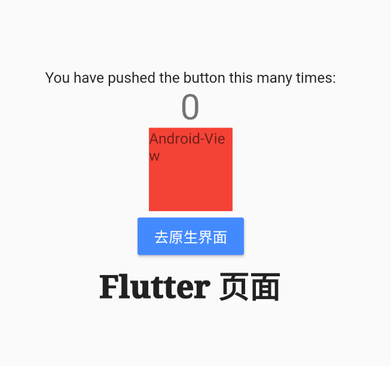

### iOS

- 创建一个类，遵循`FlutterPlatformViewFactory`协议


- 实现协议方法`- (NSObject<FlutterPlatformView>*)createWithFrame:(CGRect)frame  viewIdentifier:(int64_t)viewId arguments:(**id** **_Nullable**)args;`


- 创建一个类，遵循`FlutterPlatformView`协议 ，如上图`HJFlutterPlatformView`
- 实现协议方法，`return`你的原生视图

```
- (nonnull UIView *)view {
    UIView *v = [[UIView alloc]init];
    v.frame = CGRectMake(0, 0, 80, 60);
    v.backgroundColor = [UIColor redColor];
    UILabel *title = [[UILabel alloc]init];
    title.text = @"原生view";
    title.font = [UIFont systemFontOfSize:14];
    title.textColor = [UIColor whiteColor];
    [v addSubview:title];
    title.frame = CGRectMake(0, 0, 80, 80);
    return v;
}
```

- `Flutter 1.22.0`之前需在`info.plist`里添加`key` `io.flutter.embedded_views_preview`为`true`
- 在`Runner`工程注册一下


- `Flutter`里使用


### Android

- 创建一个类，extends `PlatformViewFactory`,并实现方法

```
public class HJPlatformFactory extends PlatformViewFactory {

    /**
     * @param createArgsCodec the codec used to decode the args parameter of {@link #create}.
     */
    public HJPlatformFactory(MessageCodec<Object> createArgsCodec) {
        super(createArgsCodec);
    }

    @Override
    public PlatformView create(Context context, int viewId, Object args) {
        return new HJActivity(context);
    }
}

```

- 创建一个类，implements `PlatformView`，在`getView`里返回视图

```
public class HJActivity implements PlatformView {

    private final TextView myView;

    HJActivity(Context context) {
        TextView myView = new TextView(context);
        myView.setText("Android-View");
        this.myView = myView;
    }
    @Override
    public View getView() {

        return myView;
    }

    @Override
    public void dispose() {

    }
}
```

- 创建插件类, implements `FlutterPlugin`

```
public class HJPlugin implements FlutterPlugin {


    @Override
    public void onAttachedToEngine(@NonNull @NotNull FlutterPlugin.FlutterPluginBinding binding) {

        binding.getPlatformViewRegistry().registerViewFactory("plugins.hj/hjView", new HJPlatformFactory(StandardMessageCodec.INSTANCE));
    }

    @Override
    public void onDetachedFromEngine(@NonNull @NotNull FlutterPlugin.FlutterPluginBinding binding) {

    }

}
```

- 注册

```
public class MainActivity extends FlutterActivity {
    
    @Override
    public void configureFlutterEngine(@NonNull @NotNull FlutterEngine flutterEngine) {
        super.configureFlutterEngine(flutterEngine);

        flutterEngine.getPlugins().add(new HJPlugin());
    }
}
```



