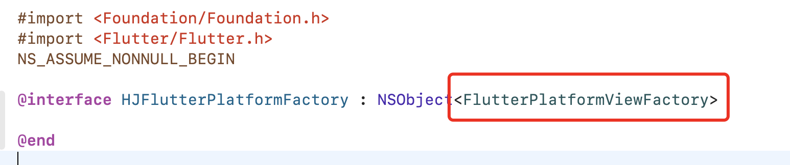
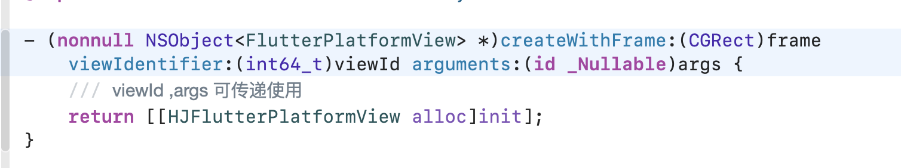
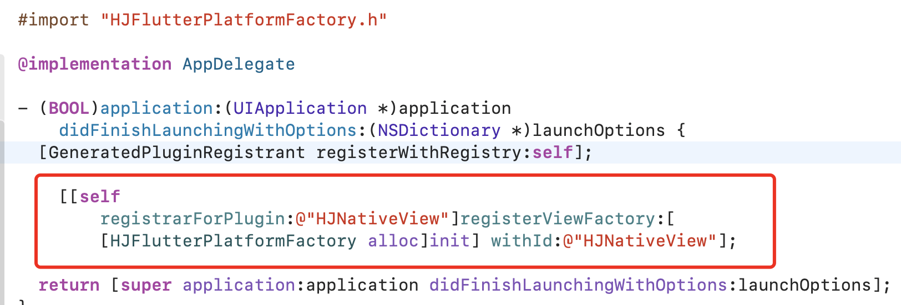
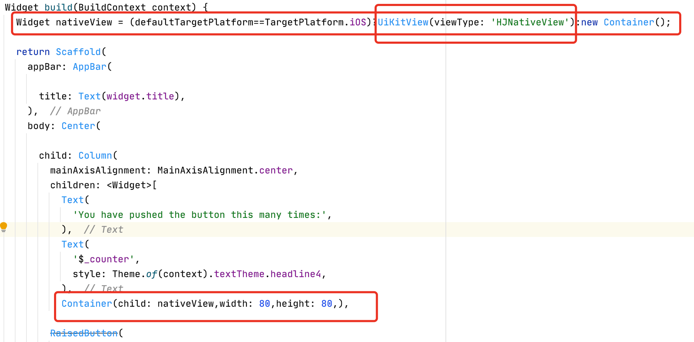
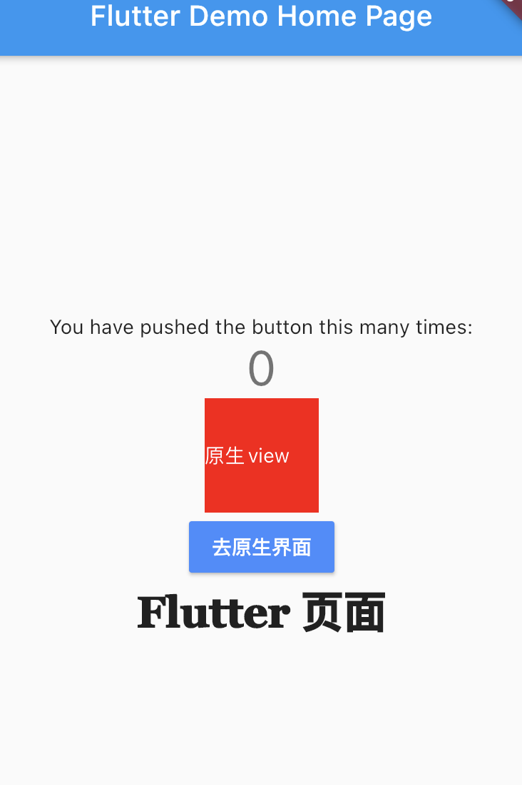

### iOS

- 创建一个类，遵循`FlutterPlatformViewFactory`协议



- 实现协议方法`- (NSObject<FlutterPlatformView>*)createWithFrame:(CGRect)frame  viewIdentifier:(int64_t)viewId arguments:(**id** **_Nullable**)args;`



- 创建一个类，遵循`FlutterPlatformView`协议 ，如上图`HJFlutterPlatformView`
- 实现协议方法，`return`你的原生视图

```
- (nonnull UIView *)view {
    UIView *v = [[UIView alloc]init];
    v.frame = CGRectMake(0, 0, 80, 60);
    v.backgroundColor = [UIColor redColor];
    UILabel *title = [[UILabel alloc]init];
    title.text = @"原生view";
    title.font = [UIFont systemFontOfSize:14];
    title.textColor = [UIColor whiteColor];
    [v addSubview:title];
    title.frame = CGRectMake(0, 0, 80, 80);
    return v;
}
```

- `Flutter 1.22.0`之前需在`info.plist`里添加`key` `io.flutter.embedded_views_preview`为`true`
- 在`Runner`工程注册一下



- `Flutter`里使用





### Android

